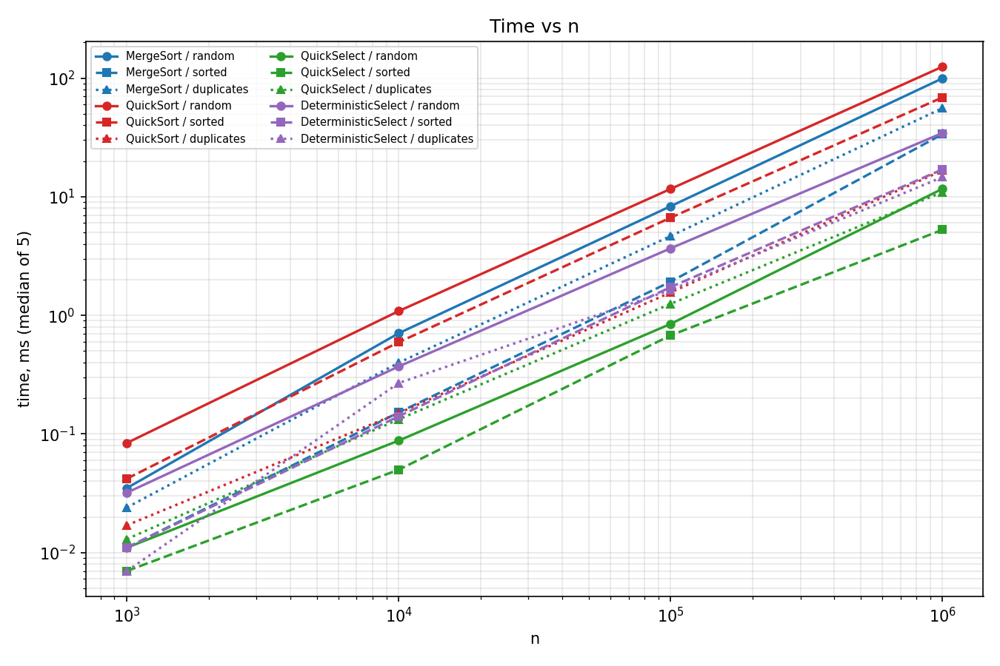
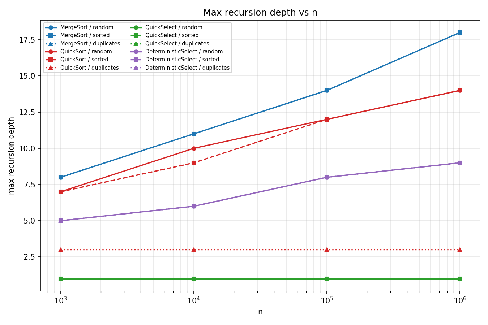
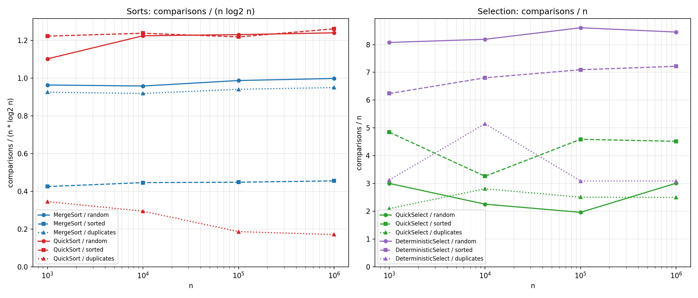

# Assignment 1: Divide and Conquer & Asymptotic Notations

Nursultan Duisenbekuly, group SE-2524s

All numbers below come from `results.csv` (median of 5 runs per case, Java 21, one machine). Comparisons are
counted once per element visited by a partition or a merge step.

## 1. Implementation summary

- **MergeSort**: one helper array is allocated in the top-level call and passed down. Subarrays of 15 elements or fewer go to insertion sort. The merge copies the range into the buffer and merges back in one linear pass.
- **QuickSort**: random pivot, 3-way partition (`<`, `=`, `>`), recursion only into the smaller side, the larger side is handled by the `while` loop.
- **QuickSelect**: same `Partition` class as QuickSort, but it keeps only the side that contains index `k`. Empty arrays and bad `k` throw `IllegalArgumentException`.
- **Bonus A**: `DeterministicSelect` (groups of 5, median of medians as pivot, same 3-way partition).
- **Bonus B**: `ClosestPair` (sort by x, split, merge by y, strip of width 2δ, at most 7 neighbours per point), checked against brute force on 100 random inputs with n up to 2000.

## 2. Asymptotic bounds

| Algorithm | Best | Average | Worst |
|---|---|---|---|
| MergeSort | Θ(n log n): merge cost stays linear even on sorted input | Θ(n log n): random input | Θ(n log n): every level still merges n elements |
| QuickSort (random pivot, 3-way) | Θ(n) when all keys are equal, one partition pass finishes it; Ω(n log n) for distinct keys | Θ(n log n): expected, any input | O(n²): only if the pivot is extreme at every step, probability is negligible |
| QuickSelect (random pivot) | Θ(n): first pivot is the k-th element, one pass | Θ(n): expected | O(n²): pivot is extreme at every step, very unlikely |
| Insertion Sort | Θ(n): already sorted input, no shifts | Θ(n²): random input, about n²/4 shifts | Θ(n²): reverse sorted input |

For the Ω(n) claim on QuickSelect: any selection algorithm has to look at every element at least once, so Ω(n) holds for every case.

## 3. Recurrences

**MergeSort.** T(n) = 2·T(n/2) + Θ(n). Here a = 2, b = 2, f(n) = n, and n^(log₂2) = n. Since f(n) = Θ(n^(log_b a)) this is case 2, so T(n) = Θ(n log n).

**QuickSort, balanced split.** T(n) = 2·T(n/2) + Θ(n). Same numbers as MergeSort, case 2, Θ(n log n).
With a random pivot the split is not always balanced, but the pivot lands in the middle half of the range with probability 1/2. Such a split leaves both parts at most 3/4 of the size, so on average every second partition shrinks the range by a constant factor. That gives an expected depth of O(log n), and each level costs O(n) in total, so the expected time is O(n log n). Solving the exact expectation gives about 2n ln n ≈ 1.39·n·log₂n comparisons for distinct keys.

**QuickSelect, balanced split.** T(n) = T(n/2) + Θ(n). Here a = 1, b = 2, f(n) = n, and n^(log₂1) = n⁰ = 1. Now f(n) = Ω(n^(0+ε)) with ε = 1, and the regularity condition holds because a·f(n/b) = n/2 ≤ (1/2)·f(n). That is case 3, so T(n) = Θ(n). This is different from MergeSort because only one half is kept, so the work at the top level dominates.

**DeterministicSelect (bonus).** T(n) ≤ T(n/5) + T(7n/10) + O(n). This does not have the Master Theorem form, but 1/5 + 7/10 = 9/10 < 1, so by substitution (or Akra–Bazzi) T(n) = Θ(n) in the worst case.

## 4. Plots

Max recursion depth at n = 10⁶: MergeSort 18, QuickSort 14 (random and sorted) and 3 (duplicates), QuickSelect 1 (it is a loop), DeterministicSelect 9. The QuickSort depth on a sorted array of 100 000 elements is also checked in `QuickSortTest` against the limit 2·log₂n.

## 5. Θ check

Ratio = comparisons / (n·log₂n) for the sorts and comparisons / n for the selects, from n = 10³ to 10⁶.

| Algorithm / input | ratio range | c1 | c2 | n0 |
|---|---|---|---|---|
| MergeSort / random | 0.96 – 1.00 | 0.95 | 1.00 | 1 000 |
| MergeSort / sorted | 0.43 – 0.46 | 0.42 | 0.46 | 1 000 |
| MergeSort / duplicates | 0.92 – 0.95 | 0.91 | 0.95 | 1 000 |
| QuickSort / random | 1.10 – 1.24 | 1.10 | 1.25 | 1 000 |
| QuickSort / sorted | 1.22 – 1.26 | 1.20 | 1.27 | 1 000 |
| QuickSort / duplicates | 0.35 → 0.17 | not Θ(n log n) | | |
| QuickSelect / all inputs | 1.96 – 4.84 | 2 | 5 | 1 000 |
| DeterministicSelect / random | 8.1 – 8.6 | 8 | 9 | 1 000 |

The ratio curves for MergeSort and for QuickSort on random and sorted input are flat from n = 10⁴ (from n = 10³ for MergeSort), so those bounds are Θ(n log n) with the constants above. Sorted MergeSort has a ratio near 0.45 because merging an already ordered pair of halves stops comparing as soon as the left half is used up, but it still scales like n log n.

QuickSort on the duplicates input is the exception. The ratio keeps falling, and comparisons / n is 4.4, 3.7, 3.9 and 3.6 for the four sizes. With only 10 distinct values the 3-way partition removes a whole group of equal keys at once, so the cost is about Θ(n) here. That is what the 3-way partition was added for.

The QuickSelect ratios are much noisier (2 to 4.8) because the count depends on the random pivots and each cell is a single median run, not an average. The values stay in a fixed band as n grows, which is what Θ(n) predicts. The theoretical expectation for the median is about 3.4n comparisons for classic two-way partition.

## 6. Discussion

The measurements agree with the theory in the parts that can be counted. MergeSort comparisons are almost exactly n·log₂n, QuickSort on random data gives 25.3 million comparisons at n = 10⁶, which is close to the expected 2n ln n − 2.85n ≈ 24.8 million, and QuickSelect and DeterministicSelect both stay linear. Depth also matches: MergeSort's 18 is the 17 halvings needed to get from 10⁶ down to 15 elements plus the leaf level, QuickSort never went above 14 even on sorted input, and it never overflowed the stack on 10⁶ sorted elements.

Time is where reality differs from the comparison counts. At n = 10⁶ on random data QuickSort needed 125 ms and MergeSort 100 ms, although MergeSort makes fewer comparisons than QuickSort. The likely reasons are branch mispredictions and swaps in the partition loop against the sequential memory access of the merge, but I did not profile this, so it is an explanation, not a measurement. On sorted input QuickSort takes 69 ms and MergeSort 34 ms, and with duplicates QuickSort is the fastest sort by far (17 ms against 56 ms).

JVM warm-up was a real problem. Before I added an untimed warm-up phase, the median for MergeSort on 100 000 random elements came out as 43.4, 13.4, 8.7 and 22.3 ms in four separate runs of the same benchmark, while after the warm-up it stays at about 8 to 8.6 ms. The first calls run in the interpreter, and the JIT compiler switches to optimized code in the middle of the run. The garbage collector matters less here, because MergeSort allocates only one buffer, but the benchmark itself clones the input arrays for every run and that produces some GC noise at the largest size. I expected the CPU cache to hurt at n = 10⁶, but the data does not show it clearly: MergeSort time divided by n·log₂n is about 5.0·10⁻⁶ ms at both 10⁵ and 10⁶, so the arrays (4 MB for the input plus 4 MB for the buffer) are still handled well by sequential access and prefetching. A larger n would be needed to see the effect. The cutoff of 15 removes the last three recursion levels, which is why the depth is 18 and not 21 for n = 10⁶.

The bonus comparison shows the price of the deterministic pivot. DeterministicSelect makes about 8.5n comparisons on random data against about 3n for QuickSelect, and it was roughly 3 times slower (34 ms against 12 ms at n = 10⁶). Its advantage is only the guarantee of O(n) in the worst case. With a random pivot the bad case is so unlikely that QuickSelect is the better choice in practice.
